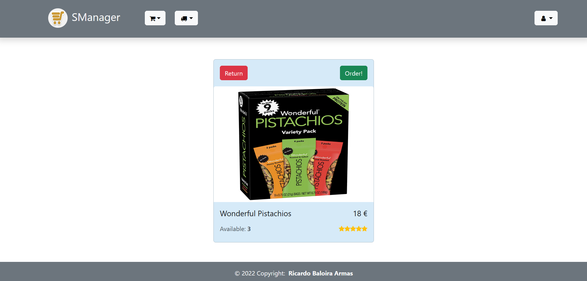
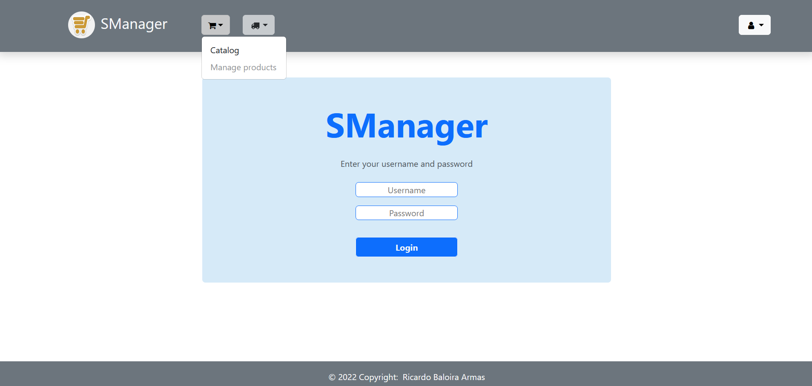
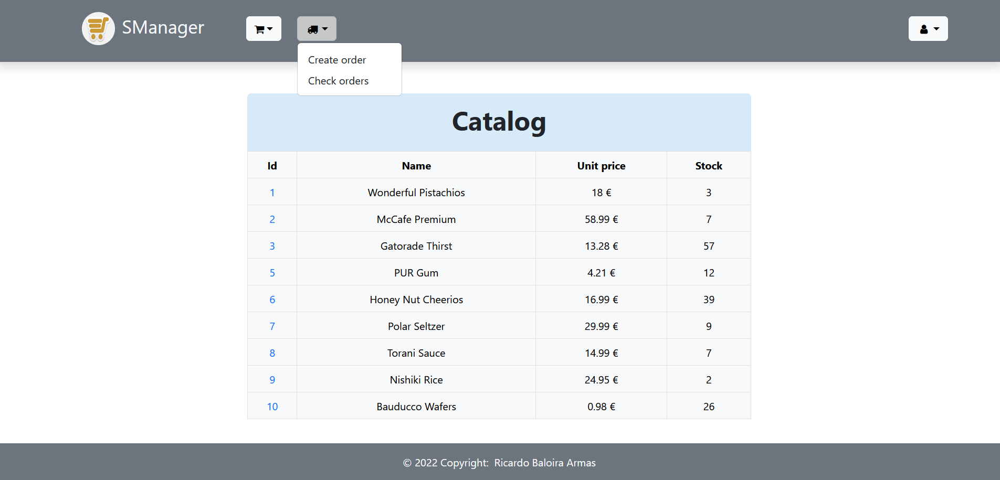

# Supermarket-Manager

**Front-end** made with **React** and **Typescript** that offers a GUI with which users can manage orders for existing products in a supermarket.
 
 
**Back-end** made with **Java** using the **Spring Framework**.
 
 
To manage its **MySQL database** I use the GUI-based application **phpMyAdmin**, inside which are stored the tables that handle information about the clients, products and orders of a supermarket.

 

| [:camera: Screenshots](#screenshots) | [📖 Features](#features) | [🔑 Relationships](#relationships) | [🤝 Contributing](#contributing) | [🔖 License](#license) |
| -------- | ----------- | ----------- | ----------- | ----------- |

 

## Screenshots

 

## Features

* **Client Management:** Keeps a record of all clients and their personal information.
 
 
* **Product Management:** Offers a comprehensive list of all products available.
 

* **Place orders:** Allows the user to place an order based on the products available.
 

* **User recognition:** Only allows users to place an order, whilst non-users can view the products available.
 

 

## Relationships

The following tables populate the app's database:
 
 
* **Client**: Which stores client's personal information.
 

* **Product:** Which stores product's data.
 

* **Orders:** Which stores order's data.
 

* **Orders_detail:** It references the order and product on which it is based thanks to both product and order foreign keys.
 

## Contributing
If you want to contribute to this proyect, follow these steps:

 

1. Fork the repository.
3. Clone your fork.
4. Check that your fork is the "origin" remote.
5. Add the project repository as the "upstream" remote using `git remote add upstream https://github.com/ricardobar96/supermarket-manager.git`.
6. Pull the latest changes from upstream into your local repository using `git pull upstream master`.
7. Create a new branch using `git checkout -b BRANCH_NAME`.
8. Make your changes and commit them: `git commit -m 'DESCRIPTION OF CHANGES'`.
9. Push your changes to your fork `git push origin BRANCH_NAME`.
10. Create a pull request.
 
 

If you have any doubts, consult [this](https://www.dataschool.io/how-to-contribute-on-github/) guide

 

## License
This project is licensed under the [MIT License](LICENSE).
